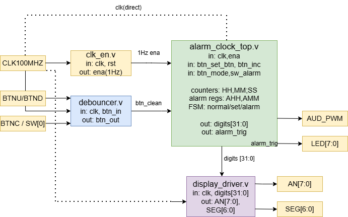

# Alarm Clock — Lab 1: Architecture

**Course:** Digital Electronics  
**Board:** Nexys A7-50T (Artix-7 XC7A50T)  
**Tool:** Vivado 2025.2  
**Language:** Verilog  

---

## Project Description

Implementation of a digital alarm clock on the Nexys A7-50T FPGA board.  
The clock displays the current time in **HH:MM:SS** format on the 8-digit 7-segment display.  
The user can set the current time and an alarm time using push buttons.  
When the alarm time is reached, the buzzer sounds and the LEDs light up.

---

## Team Members

 Arda Guner & Zay Yar Naung 

---

## Module Hierarchy (Block Diagram)



### Top-Level Inputs / Outputs

| Port | Direction | Width | Description |
|------|-----------|-------|-------------|
| `CLK100MHZ` | in | 1b | 100 MHz system clock (pin E3) |
| `BTNU` | in | 1b | Increment button |
| `BTND` | in | 1b | Confirm / alarm on-off button |
| `BTNC` | in | 1b | Mode select button |
| `SW[0]` | in | 1b | Alarm enable switch |
| `AN[7:0]` | out | 8b | 7-segment anodes (active LOW) |
| `SEG[6:0]` | out | 7b | 7-segment cathodes a–g (active LOW) |
| `AUD_PWM` | out | 1b | Buzzer PWM output |
| `LED[7:0]` | out | 8b | Alarm active indicator |

### Internal Signals

| Signal | Width | Description |
|--------|-------|-------------|
| `ena` | 1b | 1 Hz clock enable from `clk_en` |
| `btn_inc`, `btn_set`, `btn_mode` | 1b each | Debounced button outputs |
| `HH[5:0]`, `MM[5:0]`, `SS[5:0]` | 6b each | Current time registers |
| `AHH[4:0]`, `AMM[5:0]` | 5b, 6b | Alarm time registers |
| `digits[31:0]` | 32b | BCD digits fed to display driver |
| `alarm_trig` | 1b | High when current time == alarm time |
| `FSM_state[1:0]` | 2b | 0=normal, 1=set time, 2=set alarm |

---

## Pin Constraints (XDC)

Key pins used from `Nexys-A7-50T-Master.xdc`:

```tcl
# Clock
set_property -dict { PACKAGE_PIN E3  IOSTANDARD LVCMOS33 } [get_ports { CLK100MHZ }];
create_clock -add -name sys_clk_pin -period 10.00 [get_ports {CLK100MHZ}];

# Buttons
set_property -dict { PACKAGE_PIN M18 IOSTANDARD LVCMOS33 } [get_ports { BTNU }];
set_property -dict { PACKAGE_PIN P18 IOSTANDARD LVCMOS33 } [get_ports { BTND }];
set_property -dict { PACKAGE_PIN N17 IOSTANDARD LVCMOS33 } [get_ports { BTNC }];

# Switch
set_property -dict { PACKAGE_PIN J15 IOSTANDARD LVCMOS33 } [get_ports { SW[0] }];

# 7-segment anodes
set_property -dict { PACKAGE_PIN J17 IOSTANDARD LVCMOS33 } [get_ports { AN[0] }];
set_property -dict { PACKAGE_PIN J18 IOSTANDARD LVCMOS33 } [get_ports { AN[1] }];
set_property -dict { PACKAGE_PIN T9  IOSTANDARD LVCMOS33 } [get_ports { AN[2] }];
set_property -dict { PACKAGE_PIN J14 IOSTANDARD LVCMOS33 } [get_ports { AN[3] }];
set_property -dict { PACKAGE_PIN P14 IOSTANDARD LVCMOS33 } [get_ports { AN[4] }];
set_property -dict { PACKAGE_PIN T14 IOSTANDARD LVCMOS33 } [get_ports { AN[5] }];
set_property -dict { PACKAGE_PIN K2  IOSTANDARD LVCMOS33 } [get_ports { AN[6] }];
set_property -dict { PACKAGE_PIN U13 IOSTANDARD LVCMOS33 } [get_ports { AN[7] }];

# 7-segment cathodes
set_property -dict { PACKAGE_PIN T10 IOSTANDARD LVCMOS33 } [get_ports { SEG[0] }]; # CA
set_property -dict { PACKAGE_PIN R10 IOSTANDARD LVCMOS33 } [get_ports { SEG[1] }]; # CB
set_property -dict { PACKAGE_PIN K16 IOSTANDARD LVCMOS33 } [get_ports { SEG[2] }]; # CC
set_property -dict { PACKAGE_PIN K13 IOSTANDARD LVCMOS33 } [get_ports { SEG[3] }]; # CD
set_property -dict { PACKAGE_PIN P15 IOSTANDARD LVCMOS33 } [get_ports { SEG[4] }]; # CE
set_property -dict { PACKAGE_PIN T11 IOSTANDARD LVCMOS33 } [get_ports { SEG[5] }]; # CF
set_property -dict { PACKAGE_PIN L18 IOSTANDARD LVCMOS33 } [get_ports { SEG[6] }]; # CG

# Buzzer
set_property -dict { PACKAGE_PIN A11 IOSTANDARD LVCMOS33 } [get_ports { AUD_PWM }];
set_property -dict { PACKAGE_PIN D12 IOSTANDARD LVCMOS33 } [get_ports { AUD_SD  }];

# LEDs
set_property -dict { PACKAGE_PIN H17 IOSTANDARD LVCMOS33 } [get_ports { LED[0] }];
set_property -dict { PACKAGE_PIN K15 IOSTANDARD LVCMOS33 } [get_ports { LED[1] }];
```

---


## Repository Structure

```
alarm_clock/
├── README.md
├── src/
│   ├── alarm_clock_top.v
│   ├── clk_en.v
│   ├── debouncer.v
│   └── display_driver.v
├── sim/
│   ├── tb_clk_en.v
│   ├── tb_debouncer.v
│   └── tb_display_driver.v
├── constraints/
│   └── alarm_clock.xdc
├── docs/
│   ├── block_diagram.png
│   └── resource_report.txt
└── vivado/
    └── alarm_clock.xpr
```

---

## References

- [Nexys A7 Reference Manual](https://digilent.com/reference/programmable-logic/nexys-a7/reference-manual)
- [Nexys A7-50T Master XDC](https://github.com/Digilent/digilent-xdc/blob/master/Nexys-A7-50T-Master.xdc)
- Vivado 2025.2 Design Suite User Guide
