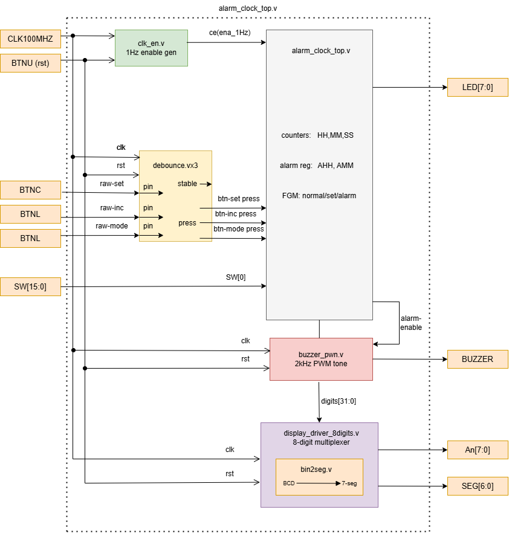
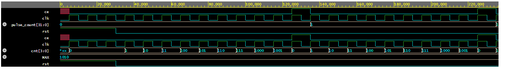
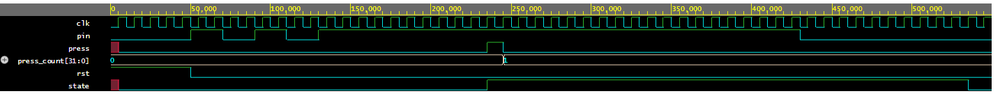
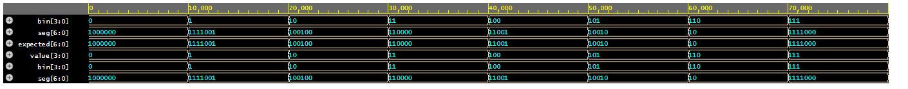
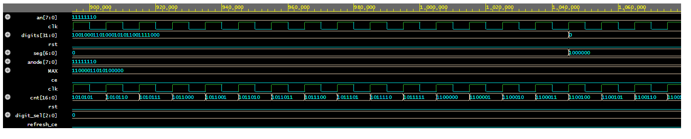
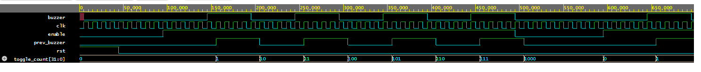
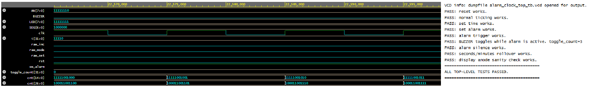

# Alarm Clock on Nexys A7-50T

**Course:** Digital Electronics  
**Team Members:** Arda Guner & Zay Yar Naung  
**Board:** Nexys A7-50T — Artix-7 XC7A50T  
**Tool:** AMD Vivado 2025.2  
**Language:** Verilog HDL  

---

## Project Description

This project implements a digital alarm clock on the **Nexys A7-50T FPGA board**.

The system displays the current time in **HH:MM:SS** format using the 8-digit seven-segment display. The user can set the current time and alarm time using push buttons. When the current time matches the alarm time and the alarm is enabled using `SW[0]`, the LEDs turn on and an external buzzer connected to a Pmod pin generates an audible alarm tone.

The project follows a modular synchronous design style. The system uses the laboratory `clk_en` and `debounce` modules, and adds project-specific modules for 8-digit display multiplexing, BCD-to-seven-segment decoding, alarm FSM control, and buzzer PWM generation.

---

## System Overview



The alarm clock is built from the following main blocks:

| Block | Purpose |
|---|---|
| `clk_en` | Generates clock-enable pulses from the 100 MHz system clock |
| `debounce` | Filters mechanical button bounce and produces clean button press pulses |
| `alarm_clock_top` | Main FSM, time counters, alarm registers, alarm trigger logic |
| `display_driver_8digit` | Multiplexes all 8 seven-segment digits |
| `bin2seg` | Converts BCD digits to seven-segment patterns |
| `buzzer_pwm` | Generates a square wave for the external buzzer |

The design uses a **single 100 MHz clock domain**. Slower behavior such as 1 Hz time counting and display refresh is implemented using clock-enable pulses, not by creating additional clocks.

---

## Hardware Interface

### Top-Level Ports

Top-level source file: [`src/alarm_clock_top.v`](src/alarm_clock_top.v)

| Port | Direction | Width | Description |
|---|---:|---:|---|
| `CLK100MHZ` | input | 1 | 100 MHz system clock |
| `BTNU` | input | 1 | Reset button |
| `BTNC` | input | 1 | Set / silence / next field button |
| `BTNL` | input | 1 | Increment selected value button |
| `BTNR` | input | 1 | Mode change button |
| `SW[15:0]` | input | 16 | Switch inputs; only `SW[0]` is used as alarm enable |
| `AN[7:0]` | output | 8 | Seven-segment anodes, active-low |
| `SEG[6:0]` | output | 7 | Seven-segment cathodes, active-low |
| `LED[7:0]` | output | 8 | Alarm active indicator |
| `BUZZER` | output | 1 | External buzzer output connected to Pmod JA1 |

### Button Mapping

| Board Control | Internal Signal | Function |
|---|---|---|
| `BTNU` | `rst` | Reset system |
| `BTNR` | `raw_mode` | Change mode: normal → set time → set alarm → normal |
| `BTNC` | `raw_set` | Select next field or silence active alarm |
| `BTNL` | `raw_inc` | Increment selected value |
| `SW[0]` | `sw_alarm` | Enable alarm matching |

### External Buzzer Connection

The Nexys A7 board does not include a simple onboard buzzer for this project. Therefore, an external buzzer is connected through a Pmod pin.

The `BUZZER` output is assigned to **Pmod JA1**, FPGA pin `C17`.

For a passive piezo buzzer:

```text
BUZZER / +  -> Pmod JA1
GND / -     -> Pmod GND
```

For an active buzzer module:

```text
SIG -> Pmod JA1
VCC -> Pmod 3.3V
GND -> Pmod GND
```

Constraint file: [`constraints/nexys.xdc`](constraints/nexys.xdc)

---

## Source Files and Testbenches

| Module | Source File | Testbench | Description |
|---|---|---|---|
| `alarm_clock_top` | [`src/alarm_clock_top.v`](src/alarm_clock_top.v) | [`sim/alarm_clock_top_tb.v`](sim/alarm_clock_top_tb.v) | Top-level FSM, timekeeping, alarm logic, display and buzzer integration |
| `clk_en` | [`src/clk_en.v`](src/clk_en.v) | [`sim/clk_en_tb.v`](sim/clk_en_tb.v) | Single-cycle clock-enable pulse generator |
| `debounce` | [`src/debounce.v`](src/debounce.v) | [`sim/debouncer_tb.v`](sim/debouncer_tb.v) | Laboratory button debouncer |
| `bin2seg` | [`src/bin2seg.v`](src/bin2seg.v) | [`sim/bin2seg_tb.v`](sim/bin2seg_tb.v) | BCD-to-seven-segment decoder |
| `display_driver_8digit` | [`src/display_driver_8digit.v`](src/display_driver_8digit.v) | [`sim/display_driver_8digit_tb.v`](sim/display_driver_8digit_tb.v) | 8-digit seven-segment multiplexing |
| `buzzer_pwm` | [`src/buzzer_pwm.v`](src/buzzer_pwm.v) | [`sim/buzzer_pwm_tb.v`](sim/buzzer_pwm_tb.v) | External buzzer square-wave generator |

---

## Technical Design

### Clock Enable Generator

The `clk_en` module is used to generate one-clock-cycle enable pulses after a fixed number of system clock cycles.

For timekeeping, the top-level uses:

```verilog
clk_en #(
    .MAX(100_000_000)
) clk_en_1hz_inst (
    .clk(clk),
    .rst(rst),
    .ce (ena_1hz)
);
```

Since the board clock is 100 MHz, `MAX = 100_000_000` generates a 1 Hz enable pulse.

This signal is used as an enable condition inside synchronous logic. It is not used as a separate clock.

---

### Button Debouncing

The project uses the laboratory `debounce` module from the course material.

Source file: [`src/debounce.v`](src/debounce.v)

Three instances are used:

```verilog
debounce debounce_set_inst  (...);
debounce debounce_inc_inst  (...);
debounce debounce_mode_inst (...);
```

The debouncer performs:

- input synchronization using two flip-flops,
- shift-register based filtering,
- stable button-state detection,
- one-clock-cycle press pulse generation.

For simulation, a reduced debounce sampling value may be used to make the waveform short and readable. For FPGA implementation, the debounce module uses the implementation value recommended in the lab material:

```verilog
localparam MAX = 200_000;
```

With a 100 MHz clock, this corresponds to approximately 2 ms.

---

### FSM Control

The top-level FSM uses named states instead of raw numeric values.

```verilog
localparam STATE_NORMAL    = 2'd0;
localparam STATE_SET_TIME  = 2'd1;
localparam STATE_SET_ALARM = 2'd2;
```

| State | Function |
|---|---|
| `STATE_NORMAL` | Time counts normally using the 1 Hz enable pulse |
| `STATE_SET_TIME` | User sets current hour, minute, and second |
| `STATE_SET_ALARM` | User sets alarm hour and minute |

The mode button cycles through the modes:

```text
NORMAL -> SET_TIME -> SET_ALARM -> NORMAL
```

Using named states improves readability, makes the state machine easier to debug, and directly addresses the project feedback about avoiding unclear numeric-only FSM states.

---

### Timekeeping Logic

The current time is stored in three 6-bit registers:

```verilog
reg [5:0] hour;
reg [5:0] minute;
reg [5:0] second;
```

During `STATE_NORMAL`, the clock advances when `ena_1hz` is high.

Rollover behavior:

```text
second: 59 -> 0
minute: 59 -> 0
hour:   23 -> 0
```

This creates a 24-hour clock.

---

### Time Setting Mode

In `STATE_SET_TIME`, the selected field can be changed using `BTNC`.

The selected field is represented by:

```verilog
localparam FIELD_HOUR   = 2'd0;
localparam FIELD_MINUTE = 2'd1;
localparam FIELD_SECOND = 2'd2;
```

The increment button `BTNL` increases the selected field.

| Field | Range |
|---|---|
| Hour | 0–23 |
| Minute | 0–59 |
| Second | 0–59 |

---

### Alarm Setting Mode

In `STATE_SET_ALARM`, the user sets the alarm hour and alarm minute.

```verilog
reg [5:0] alarm_hour;
reg [5:0] alarm_minute;
```

The alarm match condition is:

```verilog
assign alarm_match =
    sw_alarm &&
    (hour == alarm_hour) &&
    (minute == alarm_minute) &&
    (second == 6'd0);
```

The alarm only triggers when:

1. `SW[0]` is enabled,
2. current hour equals alarm hour,
3. current minute equals alarm minute,
4. current second equals zero.

---

### Alarm Trigger and Silence Logic

When the alarm match condition is true, the system sets:

```verilog
alarm_active <= 1'b1;
```

When `alarm_active` is high:

- `LED[7:0]` becomes `8'hFF`,
- `BUZZER` outputs a square wave.

The alarm can be silenced using `BTNC`.

The `alarm_ack` register prevents the alarm from immediately retriggering while the clock is still at the same matching time condition.

---

### Seven-Segment Display Driver

The original laboratory display driver was designed for two digits. This alarm clock requires the 8-digit display to show the full time. Therefore, a project-specific `display_driver_8digit` module was implemented.

Source file: [`src/display_driver_8digit.v`](src/display_driver_8digit.v)

The design follows the same multiplexing principle used in the laboratory display driver:

- only one anode is active at a time,
- the selected BCD digit is decoded using `bin2seg`,
- digit selection is advanced using a clock-enable pulse,
- the display is refreshed fast enough to appear continuously visible.

The display format is:

```text
HH MM SS 00
```

The current time is packed into a 32-bit BCD bus:

```verilog
assign digits[31:28] = hour / 10;
assign digits[27:24] = hour % 10;

assign digits[23:20] = minute / 10;
assign digits[19:16] = minute % 10;

assign digits[15:12] = second / 10;
assign digits[11: 8] = second % 10;

assign digits[ 7: 4] = 4'd0;
assign digits[ 3: 0] = 4'd0;
```

This explains why a different display driver was used: the lab driver supports fewer digits, while the alarm clock needs full 8-digit multiplexing.

---

### Buzzer PWM

The buzzer is driven by [`src/buzzer_pwm.v`](src/buzzer_pwm.v).

The buzzer output is not a constant logic level. Instead, the design generates a square wave while the alarm is active.

```verilog
buzzer_pwm #(
    .CLK_FREQ(100_000_000),
    .BUZZ_FREQ(2000)
) buzzer_inst (
    .clk   (clk),
    .rst   (rst),
    .enable(alarm_active),
    .buzzer(BUZZER)
);
```

For a 100 MHz clock and a 2 kHz buzzer tone:

```text
HALF_PERIOD = 100,000,000 / (2 × 2000) = 25,000 clock cycles
```

Therefore, the buzzer output toggles every 25,000 clock cycles and generates an approximately 2 kHz square wave.

---

## Simulation Results

Each important module was verified separately using a dedicated testbench. The complete integrated design was also verified using a top-level testbench.

The top-level simulation uses forced clean internal button pulses and a forced 1 Hz enable pulse to keep the simulation short and deterministic. The physical debouncing behavior is tested separately in the `debounce` simulation.

---

### `clk_en` Simulation

Source: [`src/clk_en.v`](src/clk_en.v)  
Testbench: [`sim/clk_en_tb.v`](sim/clk_en_tb.v)



The simulation confirms that `clk_en` generates a one-clock-cycle pulse after the counter reaches `MAX - 1`.

Verified behavior:

- reset clears the counter,
- counter increments on each clock edge,
- `ce` becomes high for exactly one clock cycle,
- counter restarts after the pulse.

---

### `debounce` Simulation

Source: [`src/debounce.v`](src/debounce.v)  
Testbench: [`sim/debouncer_tb.v`](sim/debouncer_tb.v)



The simulation verifies the laboratory debounce module.

Verified behavior:

- raw button input is synchronized,
- bouncing input is filtered,
- stable state is generated,
- a single-cycle `press` pulse is generated after a stable press.

For simulation visibility, a reduced sampling value can be used. For implementation, `MAX = 200_000` is used.

---

### `bin2seg` Simulation

Source: [`src/bin2seg.v`](src/bin2seg.v)  
Testbench: [`sim/bin2seg_tb.v`](sim/bin2seg_tb.v)



The simulation verifies the BCD-to-seven-segment decoder.

Verified behavior:

- digits 0 through 9 produce the expected active-low seven-segment patterns,
- invalid BCD values produce the blank pattern.

---

### `display_driver_8digit` Simulation

Source: [`src/display_driver_8digit.v`](src/display_driver_8digit.v)  
Testbench: [`sim/display_driver_8digit_tb.v`](sim/display_driver_8digit_tb.v)



The simulation verifies the 8-digit display driver.

Verified behavior:

- `AN[7:0]` cycles through active-low anode patterns,
- only one digit is enabled at a time,
- `SEG[6:0]` changes according to the selected BCD digit,
- the display driver completes repeated scan cycles.

---

### `buzzer_pwm` Simulation

Source: [`src/buzzer_pwm.v`](src/buzzer_pwm.v)  
Testbench: [`sim/buzzer_pwm_tb.v`](sim/buzzer_pwm_tb.v)



The simulation verifies the buzzer PWM module.

Verified behavior:

- when `enable = 0`, `buzzer = 0`,
- when `enable = 1`, `buzzer` toggles as a square wave,
- when `enable` returns to 0, the buzzer output returns to 0.

---

### Top-Level Simulation

Source: [`src/alarm_clock_top.v`](src/alarm_clock_top.v)  
Testbench: [`sim/alarm_clock_top_tb.v`](sim/alarm_clock_top_tb.v)



The top-level simulation verifies the complete system behavior.

The following checks passed:

```text
PASS: reset works.
PASS: normal ticking works.
PASS: set time works.
PASS: set alarm works.
PASS: alarm trigger works.
PASS: BUZZER toggles while alarm is active.
PASS: alarm silence works.
PASS: seconds/minutes rollover works.
PASS: display anode sanity check works.
ALL TOP-LEVEL TESTS PASSED.
```

Verified behavior:

- reset initializes the system correctly,
- seconds increment during normal mode,
- set-time mode updates hour, minute, and second fields,
- set-alarm mode updates alarm hour and minute,
- alarm triggers when current time equals alarm time,
- LEDs turn on during alarm,
- buzzer toggles during alarm,
- alarm can be silenced,
- seconds and minutes rollover correctly,
- display anode multiplexing is valid.

---

## FPGA Implementation & Demo Video


The design was synthesized, implemented, and tested on the Digilent Nexys A7-50T FPGA board. A short demonstration video showing the implemented alarm clock system can be accessed from the link below:

[Watch the FPGA Alarm Clock Demo Video](https://drive.google.com/file/d/1Ip6K3iLx0Ul9pQ4m5QgAsPLqSCCL0Y30/view?usp=sharing)


Implementation files:

- Top-level module: [`src/alarm_clock_top.v`](src/alarm_clock_top.v)
- Constraint file: [`constraints/nexys.xdc`](constraints/nexys.xdc)


Vivado steps:

1. Create or open the Vivado RTL project.
2. Add all Verilog files from `src/`.
3. Add the XDC file from `constraints/`.
4. Set `alarm_clock_top` as the top module.
5. Run RTL elaboration.
6. Run synthesis.
7. Check for inferred latches.
8. Open the utilization report.
9. Run implementation.
10. Generate bitstream.
11. Program the Nexys A7-50T board.

Important implementation note:

The `debounce` module should use:

```verilog
localparam MAX = 200_000;
```

for the actual FPGA bitstream.

---

## Pin Constraints

Constraint file: [`constraints/nexys.xdc`](constraints/nexys.xdc)

Important assignments:

| Signal | Board Resource |
|---|---|
| `CLK100MHZ` | 100 MHz board clock |
| `BTNU` | Reset |
| `BTNC` | Set / silence / next field |
| `BTNL` | Increment |
| `BTNR` | Mode |
| `SW[0]` | Alarm enable |
| `LED[7:0]` | Alarm indicator |
| `AN[7:0]` | Seven-segment anodes |
| `SEG[6:0]` | Seven-segment cathodes |
| `BUZZER` | Pmod JA1 / external buzzer output |

---

## Resource Report

After synthesis, the utilization report should be added here.

| Resource | Used |
|---|---:|
| LUT | To be filled after synthesis |
| FF | To be filled after synthesis |
| IO | To be filled after synthesis |
| BUFG | To be filled after synthesis |

Vivado location:

```text
Flow Navigator -> Synthesis -> Open Synthesized Design -> Report Utilization
```

---

## Design Notes and Decisions

### Use of Laboratory Modules

The project uses the course-provided `clk_en` and `debounce` modules. This follows the project rule that standard laboratory components should be reused.

### Named FSM States

The main FSM uses named local parameters such as `STATE_NORMAL`, `STATE_SET_TIME`, and `STATE_SET_ALARM` instead of raw numbers. This makes the design clearer and easier to debug.

### Display Driver Extension

The laboratory display driver supports fewer digits, while the alarm clock requires an 8-digit display. Therefore, `display_driver_8digit` was implemented using the same multiplexing principle from the laboratory design.

### External Buzzer

The project uses an external buzzer connected through Pmod JA1. The buzzer is driven by a square wave generated by `buzzer_pwm`, instead of being driven by a constant logic level.

### Single Clock Domain

All sequential logic runs on the 100 MHz system clock. Slower operations are controlled using clock-enable signals.

---

## References and Tools

- Tomas Fryza, **Digital Electronics Verilog Examples**, Brno University of Technology, 2026.
- Laboratory 5: Multiple seven-segment displays.
- Laboratory 6: Button debounce.
- Laboratory 8: Verilog Projects 2026.
- Digilent Nexys A7-50T Reference Manual.
- AMD Vivado 2025.2.
- Verilog HDL.
- EDA Playground / Icarus Verilog for module-level simulations.
