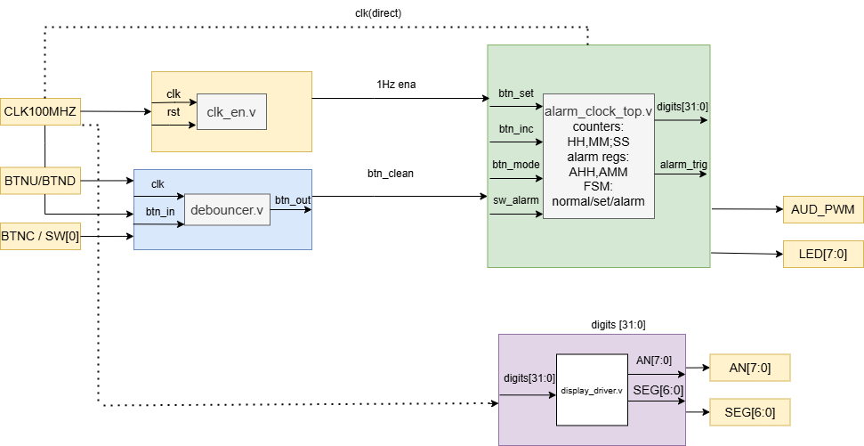
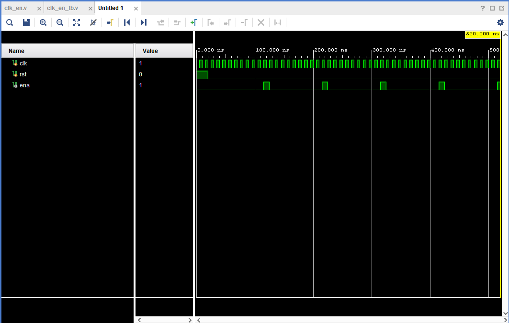
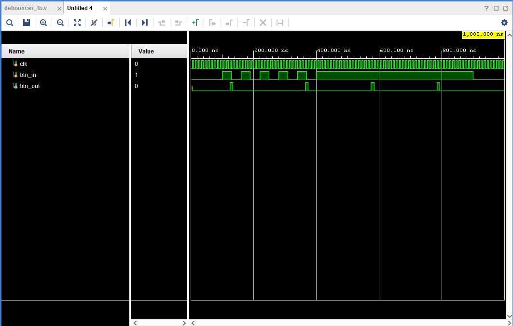
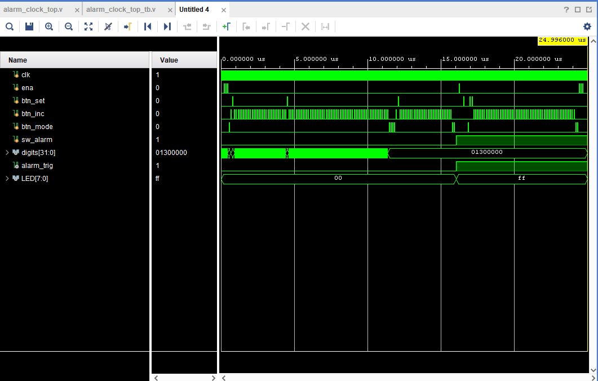
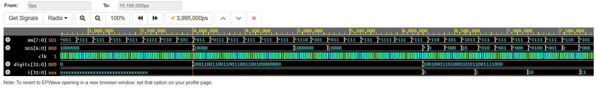

# Alarm Clock — Lab 1: Architecture

**Course:** Digital Electronics  
**Board:** Nexys A7-50T (Artix-7 XC7A50T)  
**Tool:** Vivado 2025.2  
**Language:** Verilog  

---

## Project Description

Implementation of a digital alarm clock on the Nexys A7-50T FPGA board.  
The clock displays the current time in **HH:MM:SS** format on the 8-digit 7-segment display.  
The user can set the current time and an alarm time using push buttons.  
When the alarm time is reached, the buzzer sounds and the LEDs light up.

---

## Team Members

 Arda Guner & Zay Yar Naung 

---

## Module Hierarchy (Block Diagram)



### Top-Level Inputs / Outputs

| Port | Direction | Width | Description |
|------|-----------|-------|-------------|
| `CLK100MHZ` | in | 1b | 100 MHz system clock (pin E3) |
| `BTNU` | in | 1b | Increment button |
| `BTND` | in | 1b | Confirm / alarm on-off button |
| `BTNC` | in | 1b | Mode select button |
| `SW[0]` | in | 1b | Alarm enable switch |
| `AN[7:0]` | out | 8b | 7-segment anodes (active LOW) |
| `SEG[6:0]` | out | 7b | 7-segment cathodes a–g (active LOW) |
| `AUD_PWM` | out | 1b | Buzzer PWM output |
| `LED[7:0]` | out | 8b | Alarm active indicator |

### Internal Signals

| Signal | Width | Description |
|--------|-------|-------------|
| `ena` | 1b | 1 Hz clock enable from `clk_en` |
| `btn_inc`, `btn_set`, `btn_mode` | 1b each | Debounced button outputs |
| `HH[5:0]`, `MM[5:0]`, `SS[5:0]` | 6b each | Current time registers |
| `AHH[4:0]`, `AMM[5:0]` | 5b, 6b | Alarm time registers |
| `digits[31:0]` | 32b | BCD digits fed to display driver |
| `alarm_trig` | 1b | High when current time == alarm time |
| `FSM_state[1:0]` | 2b | 0=normal, 1=set time, 2=set alarm |

---

## Pin Constraints (XDC)

 [Nexys A7-50T](constraints/nexys)


## Repository Structure

```
alarm_clock/
├── README.md
├── images/
│   └── Block_Diagram.png
│   └──alarm_clock_top_simulation.png
│   └──clk_en_tb.png
│   └──debouncer_simulation.png
│   └──display_driver.png
├── src/
│   └── alarm_clock_top.v
│   └── clk_en.v
│   └── debouncer.v
│   └── display_driver.v
│   └── Block_Diagram.png
├── sim/
│   └── alarm_clock_top.v
│   └── clk_en_tb.v
│   └── debouncer_tb.v
│   └──display_driver.v
```

---
## Design sources and testbenches
 1) [clk_en.v](src/clk_en.v) /
    [clk_en_tb.v](sim/clk_en_tb.v)
    
    
    ### Description
The testbench verifies that `clk_en` generates a single-cycle `ena` pulse at the
correct frequency. The simulation uses a reduced `MAX = 9` (instead of
`100_000_000 - 1`) so that the 1 Hz behaviour can be observed within a 500 ns
simulation window.

**Test sequence:**

a) **Reset (0–20 ns):** `rst` is held high. Both `count` and `ena` are forced to
   `0`. No pulse is produced during this period.

b) **First pulse (~120 ns):** After reset is released, `count` increments on every
   rising edge of `clk`. When it reaches `MAX = 9`, `ena` goes high for exactly
   one clock cycle (10 ns), then returns to `0` and `count` resets to `0`.

c) **Subsequent pulses:** The pattern repeats every 10 clock cycles (~100 ns),
   confirming that the period is correct and the pulse width is always exactly
   1 cycle regardless of how long the simulation runs.

 3) [debouncer.v](src/debouncer.v) /
    [debouncer_tb.v](sim/debouncer_tb.v)
    
    
 4) [alarm_clock_top.v](src/alarm_clock_top.v) /
    [alarm_clock_top_tb.v](sim/alarm_clock_top_tb.v)


 5) [display_driver.v](src/display_driver.v) /
    [display_driver_tb.v](sim/display_driver_tb.v)


